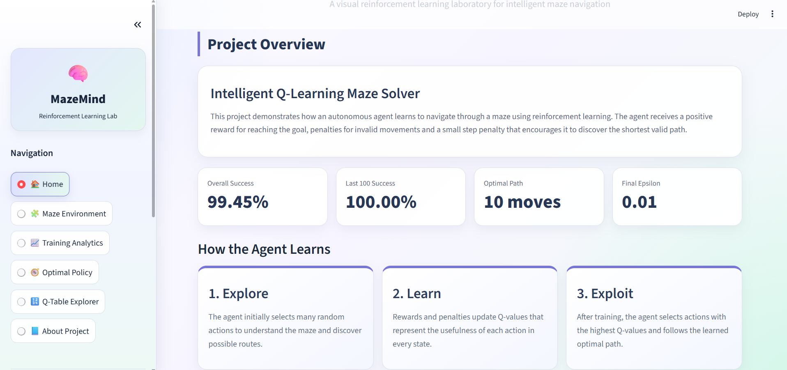
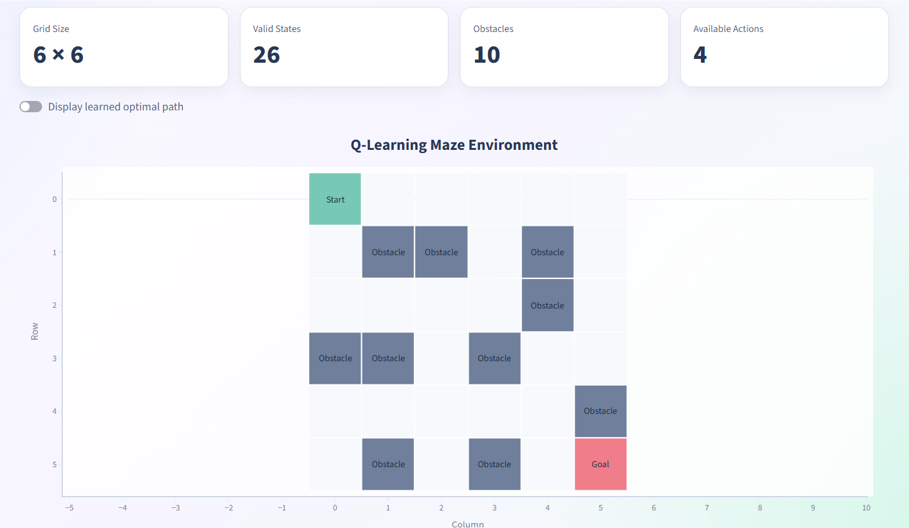
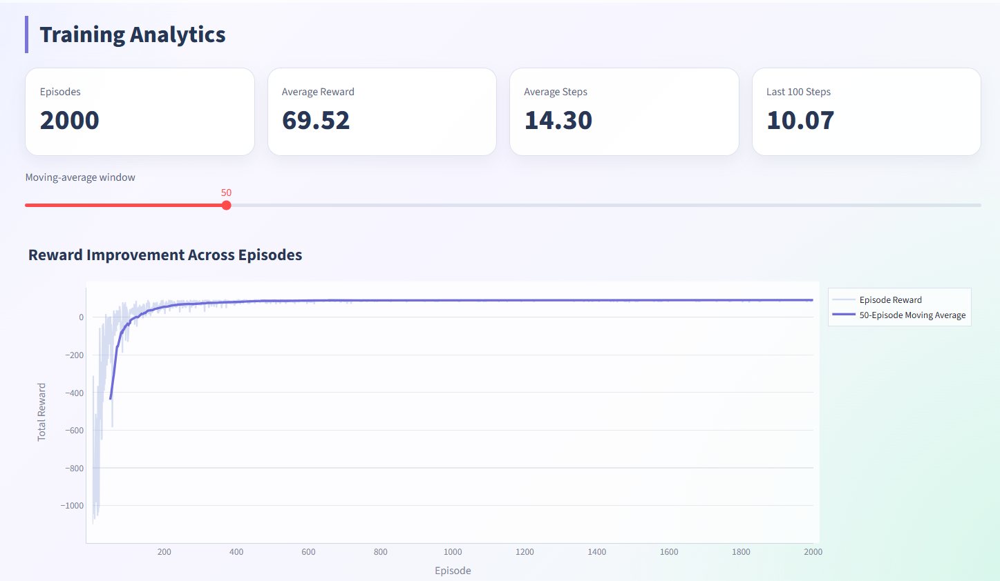
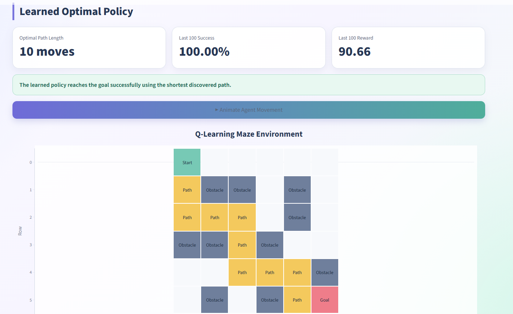
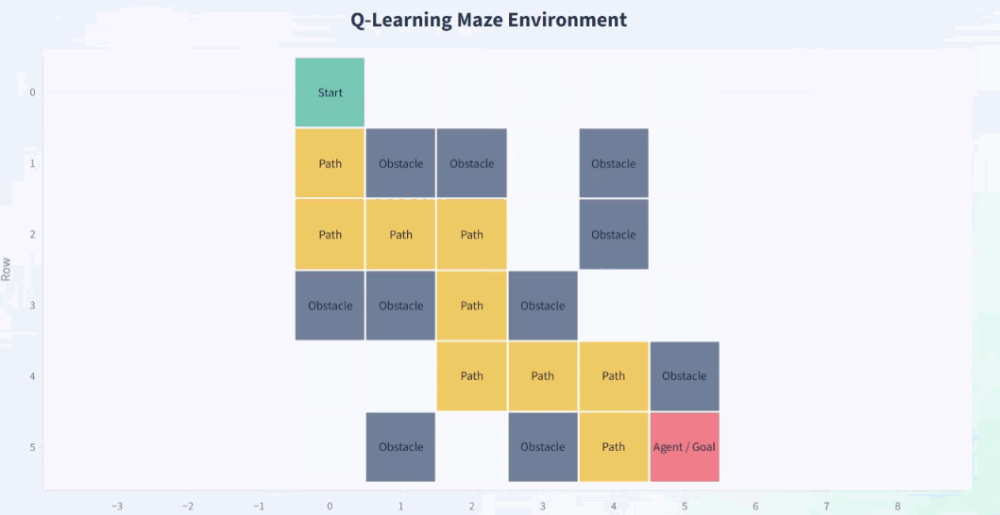
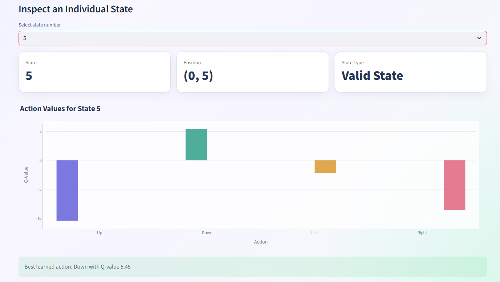
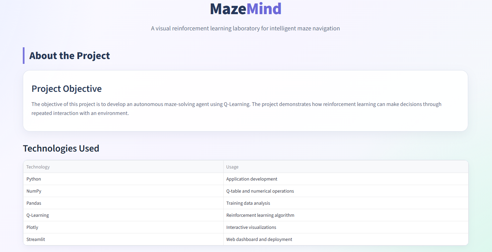

# Q-Learning Maze Solver using Reinforcement Learning

A reinforcement learning project that demonstrates how an intelligent agent learns to navigate through a custom maze using the Q-Learning algorithm. The agent learns the optimal path by interacting with the environment, receiving rewards and penalties, and continuously updating its Q-values.

The project also includes an interactive Streamlit dashboard for visualizing the training process, learned policy, Q-table, and optimal navigation path.

---

## Live Demo

**Application**

https://q-learning-maze-6ksfzyievvf8wq5xlwtjyx.streamlit.app/

**GitHub Repository**

https://github.com/Aruna2715/Q-Learning-Maze

---

# Project Overview

This project implements the Q-Learning algorithm completely from scratch without using any reinforcement learning libraries.

A custom 6×6 maze environment is designed where an intelligent agent learns the shortest path between the start and goal positions through trial-and-error learning.

The dashboard provides an interactive visualization of:

- Maze Environment
- Training Performance
- Learned Policy
- Q-Table
- Agent Navigation
- Performance Metrics

---

# Features

- Custom Maze Environment
- Q-Learning Algorithm from Scratch
- Epsilon-Greedy Exploration
- Dynamic Q-Table Generation
- Reward-Based Learning
- Training Analytics
- Policy Visualization
- Optimal Path Extraction
- Agent Movement Animation
- Interactive Streamlit Dashboard

---

# Technologies Used

- Python
- NumPy
- Pandas
- Plotly
- Matplotlib
- Streamlit

---

# Reinforcement Learning Workflow

```
Initialize Environment
        │
        ▼
Initialize Q-Table
        │
        ▼
Choose Action (ε-Greedy)
        │
        ▼
Move Agent
        │
        ▼
Receive Reward
        │
        ▼
Update Q-Table
        │
        ▼
Repeat Training
        │
        ▼
Optimal Policy Learned
```

---

# Bellman Equation

The Q-Learning algorithm updates its knowledge using the Bellman Equation.

```
Q(s,a) ← Q(s,a) + α [ r + γ max Q(s',a') − Q(s,a) ]
```

Where

- **Q(s,a)** → Current Q-value
- **α** → Learning Rate
- **γ** → Discount Factor
- **r** → Reward
- **s'** → Next State

---

# Training Configuration

| Parameter | Value |
|-----------|-------|
| Episodes | 2000 |
| Learning Rate | 0.10 |
| Discount Factor | 0.95 |
| Initial Epsilon | 1.00 |
| Minimum Epsilon | 0.01 |
| Epsilon Decay | 0.995 |
| Maximum Steps | 200 |

---

# Performance Results

| Metric | Result |
|--------|-------:|
| Total Episodes | 2000 |
| Overall Success Rate | **99.45%** |
| Last 100 Episodes Success Rate | **100.00%** |
| Overall Average Reward | **69.52** |
| Last 100 Episodes Average Reward | **90.66** |
| Overall Average Steps | **14.30** |
| Last 100 Episodes Average Steps | **10.07** |
| Optimal Path Length | **10 Moves** |
| Final Epsilon | **0.01** |

---

# Dashboard

## Home Page

Provides an overview of the project, learning process, Bellman Equation, workflow, and key performance metrics.



---

## Maze Environment

Visualizes the custom maze, reward structure, obstacles, and learned path.



---

## Training Analytics

Displays training progress through interactive graphs including:

- Reward vs Episodes
- Steps vs Episodes
- Exploration Decay
- Success Rate



---

## Optimal Policy

Displays the optimal path learned by the agent and visualizes the navigation policy.



---

## Agent Navigation Animation

The dashboard includes an animated visualization of the agent moving through the learned optimal path.



---

## Q-Table Explorer

Inspect every maze state, compare Q-values, and identify the best action learned for each state.



---

## About Project

Contains project information, technologies used, hyperparameters, applications, and future improvements.



---

# Project Structure

```
Q-Learning-Maze
│
├── app.py
├── q_learning_maze.ipynb
├── requirements.txt
├── README.md
│
├── models
│   └── q_table.npy
│
├── results
│   ├── evaluation_metrics.csv
│   ├── optimal_path.csv
│   └── training_history.csv
│
└── screenshots
    ├── homepage.png
    ├── maze_environment.png
    ├── training_analytics.png
    ├── optimal_policy.png
    ├── maze_animation.gif
    ├── qtable_explorer.png
    └── about_project.png
```

---

# Installation

Clone the repository

```bash
git clone https://github.com/Aruna2715/Q-Learning-Maze.git
```

Move into the project directory

```bash
cd Q-Learning-Maze
```

Install the required packages

```bash
pip install -r requirements.txt
```

Run the Streamlit application

```bash
streamlit run app.py
```

---

# Future Enhancements

- Dynamic maze generation
- Multiple maze sizes
- Deep Q-Network (DQN)
- SARSA implementation
- User-created mazes
- Real-time training visualization

---

# Internship Details

| Field | Information |
|-------|-------------|
| Intern Name | Aruna V S |
| Intern ID | CITS5433 |
| Internship | Machine Learning Internship |
| Organization | CODTECH IT Solutions |
| Task | Task 2 – Deep Reinforcement Learning (Q-Learning) |


---

# Author

**Aruna V S**

GitHub: https://github.com/Aruna2715

LinkedIn: *(Add your LinkedIn profile here if you would like to include it.)*

---

# License

This project has been developed for educational and internship purposes.
